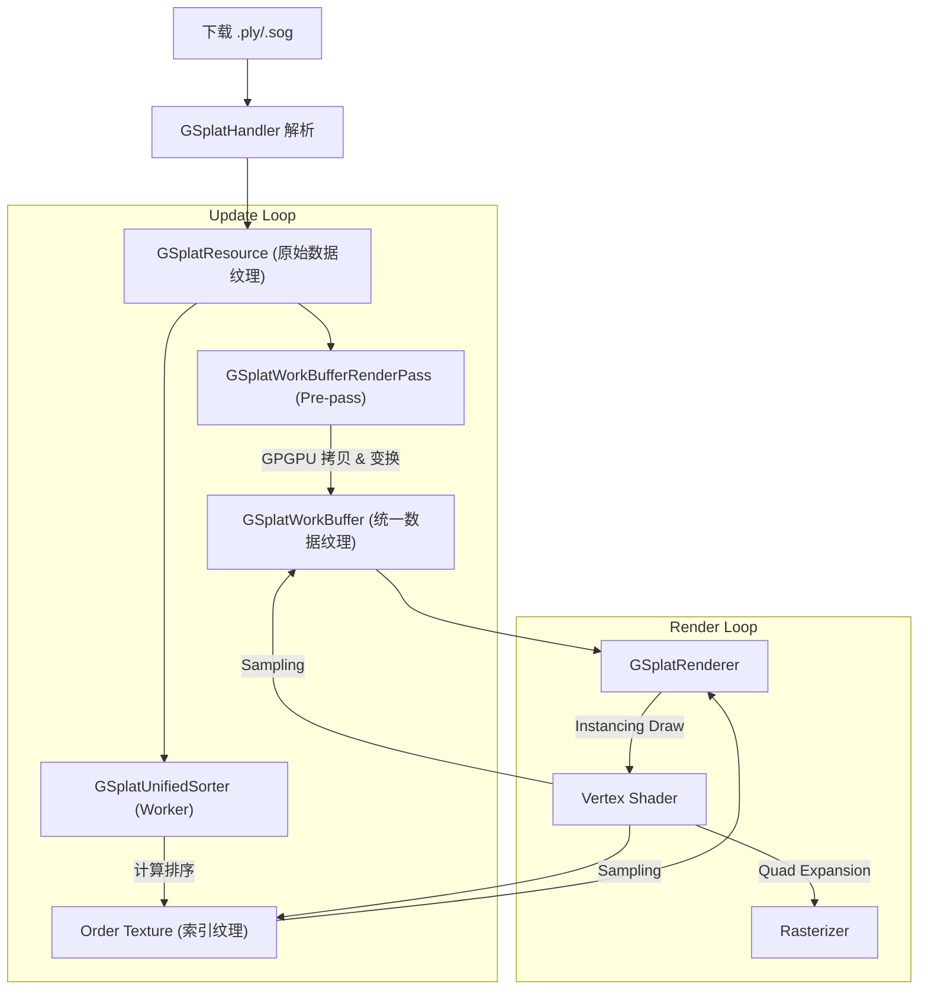
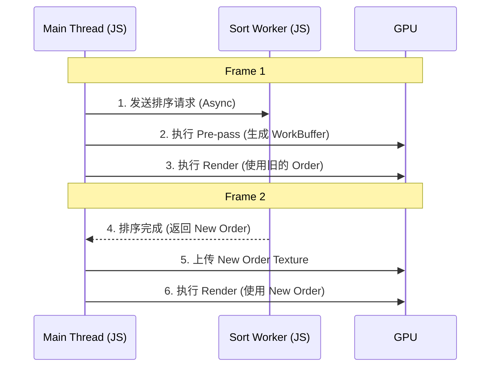
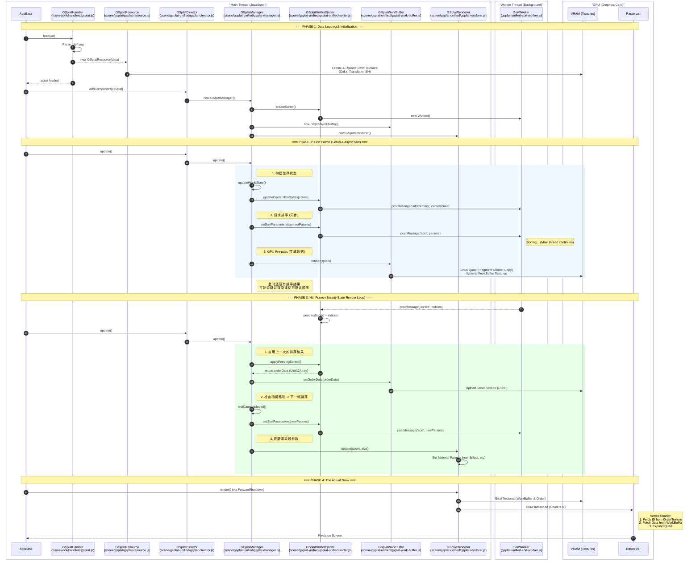
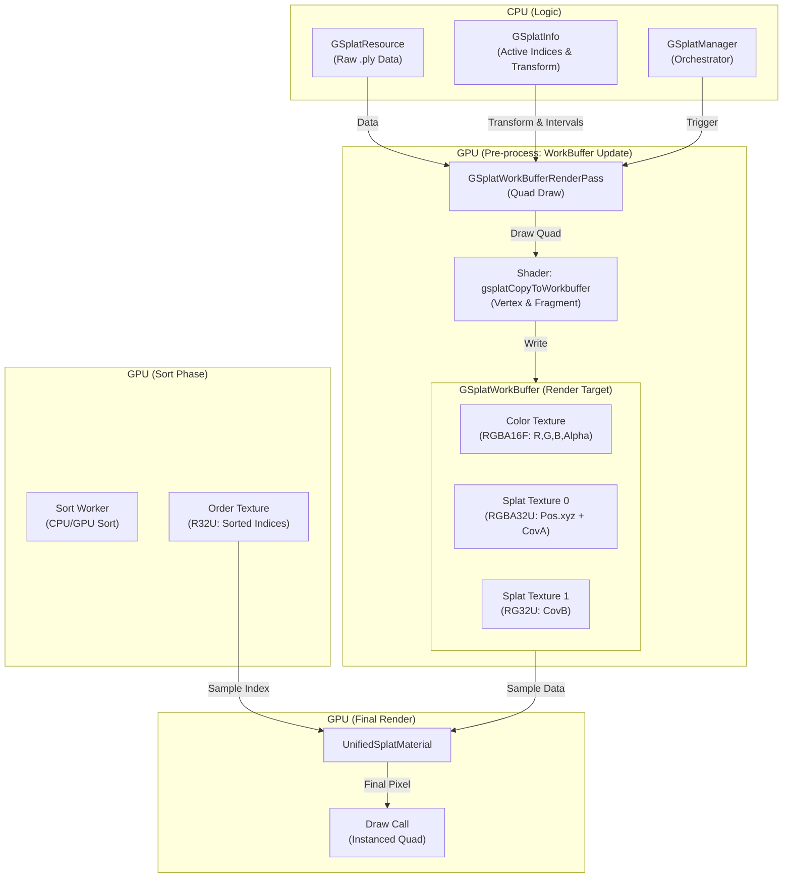

PlayCanvas 的 Gaussian Splatting (GS) 渲染流程采用了先进的 **Unified Work Buffer (统一工作缓冲)** 架构。这种架构不仅支持高效的视锥剔除和 LOD 管理，还能通过合批（Batching）极大地减少 Draw Call。

以下是基于代码库的深度分析，涵盖从数据加载到最终渲染的完整链路。

# 渲染流程

### 1. 数据链路：下载与解析

数据的旅程始于 `GSplatHandler`，它是 PlayCanvas 资源加载系统的一部分。

*   **加载入口**: `src/framework/handlers/gsplat.js`
    *   `GSplatHandler` 根据文件扩展名选择解析器。支持 `.ply` (标准格式) 和 `.sog` / `.json` (PlayCanvas 自研的压缩格式 SOGS)。
*   **解析器**:
    *   **PLY**: `src/framework/parsers/ply.js` 解析标准 PLY 头和二进制数据。
    *   **SOGS**: `src/framework/parsers/sog-bundle.js` 解析压缩后的数据包。SOGS 使用了 quantization (量化) 来压缩位置、旋转和球谐系数 (SH)，显著减小显存占用。
*   **资源对象**:
    *   解析后的数据被封装为 `GSplatData` 或 `GSplatSogsData`。
    *   最终创建为 GPU 资源 `GSplatResource` (`src/scene/gsplat/gsplat-resource.js`)。

#### 核心要点：数据组织 (Texture Layout)
为了在 GPU 上高效访问，PlayCanvas 将所有 Splat 数据打包到纹理中（Data Texture），而不是使用 Vertex Buffer。这允许在 Vertex Shader 中通过纹理采样随机访问任意 Splat。

在 `GSplatResource` 中，数据被上传到以下纹理：
*   **Color Texture** (`RGBA16F`): 存储颜色。
*   **TransformA** (`RGBA32U`): 存储位置 (`xyz`) 和旋转四元数的一部分。
*   **TransformB** (`RGBA16F`): 存储缩放 (`scale`) 和旋转四元数的另一部分。
*   **SH Textures**: 存储球谐系数（如果存在）。

---

### 2. 核心架构：Unified Work Buffer 渲染管线

这是 PlayCanvas 实现高性能渲染的核心。传统的做法是每个模型绘制一次，但 PlayCanvas 将场景中所有可见的 Splat 实例“拷贝”到一个全局的 **Work Buffer** 中，然后进行一次性绘制。

#### 流程概览
1.  **Pre-pass (GPGPU)**: 计算可见性、LOD，并将数据填入 Work Buffer。
2.  **Sorting (CPU Worker)**: 对所有 Splat 进行全局排序。
3.  **Rendering**: 基于 Work Buffer 进行单次绘制。

#### 步骤一：Pre-pass (写入 Work Buffer)
*   **代码位置**: `src/scene/gsplat-unified/gsplat-work-buffer-render-pass.js`
*   **逻辑**:
    *   这是一个 GPGPU 操作（利用 Fragment Shader 模拟 Compute Shader）。
    *   它遍历所有激活的 `GSplatInfo`（即 Splat 实例）。
    *   通过绘制覆盖 Work Buffer 对应区域的 Quad，触发 Fragment Shader (`gsplatCopyToWorkbuffer.js`)。
    *   **Shader 逻辑**:
        *   根据像素坐标计算当前处理的是哪个 Splat。
        *   从原始 `GSplatResource` 纹理中读取数据。
        *   应用模型矩阵（Model Matrix）变换。
        *   写入到 `GSplatWorkBuffer` 的 MRT (多重渲染目标) 纹理中。

#### 步骤二：全局排序 (Sorting)
高斯渲染必须严格遵循从后往前的顺序（Back-to-Front），否则透明混合会出错。

*   **代码位置**: `src/scene/gsplat-unified/gsplat-unified-sorter.js` & `gsplat-unified-sort-worker.js`
*   **Worker 优化**: 排序在 Web Worker 中运行，避免阻塞主线程。
*   **核心算法**: **基数排序 (Radix Sort)**。
*   **数学优化 (Local Space Projection)**:
    *   为了避免每帧在 CPU 上对百万个点做世界空间变换，Worker 缓存了 Splat 的**局部空间**中心点。
    *   它计算出一个 `transformedDirection` (视线方向在局部空间的逆变换)。
    *   直接计算 `dot(localCenter, transformedDirection)` 即可得到深度值，无需全矩阵乘法。
*   **输出**: 排序结果是一个索引数组，上传到 `orderTexture` (WebGL) 或 `StorageBuffer` (WebGPU)。

#### 步骤三：最终渲染 (Rendering)
*   **代码位置**: `src/scene/gsplat-unified/gsplat-renderer.js`
*   **逻辑**:
    *   执行一次 Draw Call (Instancing)。
    *   实例数量 = Work Buffer 中的有效 Splat 总数。
*   **Shader**: `src/scene/shader-lib/glsl/chunks/gsplat/vert/gsplat.js`
    *   **Vertex Shader**:
        1.  通过 `gl_InstanceID` 从 `orderTexture` 获取排序后的 Splat ID。
        2.  用 ID 从 Work Buffer 的纹理中采样位置、协方差、颜色。
        3.  **Quad 扩展**: 调用 `initCorner`，利用协方差矩阵计算出 2D 投影平面的轴向和范围，将一个顶点扩展为一个覆盖该高斯的 Quad (4个顶点)。
        4.  **特效注入**: 调用 `modifyCenter` (如 `reveal-rain.mjs` 中的逻辑) 实现动态效果。

---

### 3. 核心代码分析

#### A. Shader 组织
PlayCanvas 使用 Chunk 系统来组织 Shader，便于复用和扩展。
*   `gsplatCenter.js`: 负责将中心点投影到屏幕空间。
*   `gsplatCorner.js`: 核心数学逻辑。根据协方差矩阵 (`covA`, `covB`) 计算屏幕空间的包围盒和纹理坐标，实现 Splat 的光栅化形状。
*   `gsplatSogsData.js`: 处理 SOGS 压缩数据的解压。

#### B. 内存与性能优化
1.  **SOGS 压缩**:
    *   位置和旋转使用量化存储（例如 `unpack8888`），大幅减少显存带宽压力。
2.  **LOD 系统**:
    *   `GSplatPlacement` (`gsplat-placement.js`) 支持八叉树 (Octree) 组织。
    *   Pre-pass 阶段根据距离选择合适的 LOD 层级，只将需要的 Splat 写入 Work Buffer，极大减少了顶点着色器的负载。
3.  **Instancing & Texture Fetch**:
    *   利用 Vertex Texture Fetch (VTF) 代替巨大的 Vertex Buffer，减少了内存碎片，并且允许动态数据（如动画）通过更新小纹理来实现。

### 总结流程图



这种架构展示了 PlayCanvas 在 Web 3D 领域的深厚功底，特别是在处理海量数据渲染时的架构设计能力。

# Q&A

## Q: Update Loop 和 Render Loop是两个线程吗，为什么分开写？这两个部分在代码中是分开的吗？

这是一个非常专业且敏锐的问题！

简单回答：**Update Loop 和 Render Loop 并不完全是两个“线程”，但在逻辑和物理上确实是分离的。其中，“排序”部分确实跑在独立的线程（Web Worker）中。**

为了性能最大化，PlayCanvas 将“准备数据”和“使用数据”拆分得非常彻底。

### 1. 它们是两个线程吗？

**不全是，但在核心瓶颈上是多线程的。**

*   **Main Thread (主线程)**: 负责 `GSplatManager` 的逻辑判断、LOD 计算、以及提交 GPU 指令（包括 Pre-pass 和最终渲染）。
*   **Worker Thread (后台线程)**: **这是关键！** `GSplatUnifiedSorter` 启动了一个 Web Worker (`gsplat-unified-sort-worker.js`)。
    *   **排序 (Sorting)** 这个最耗 CPU 的操作是在后台线程跑的。
    *   主线程不会因为排序几百万个点而被卡住。
*   **GPU**: 负责 Pre-pass 的数据拷贝和最终的像素绘制。

所以，“Update Loop”中的排序是**异步并行**的，而“Render Loop”是在主线程提交给 GPU 执行的。

### 2. 为什么分开写？（为什么要解耦？）

这就涉及到了**高性能渲染管线的设计哲学**：

1.  **异步排序 (Latency Hiding)**:
    *   高斯泼溅必须排序（从后往前画），但排序几百万个点非常慢。
    *   如果放在 Render Loop 里同步执行，FPS 会直接掉到个位数。
    *   **策略**: 主线程继续画上一帧的排序结果，Worker 线程在后台慢慢排。排好了，主线程下一帧就用新的顺序。虽然有一两帧的延迟，但画面极其流畅。

2.  **数据驱动 (Data-Oriented Design)**:
    *   **Update Loop (生产者)**: 它的任务是生成“数据纹理”（Work Buffer 和 Order Texture）。它不关心怎么画，只关心数据对不对。
    *   **Render Loop (消费者)**: 它的任务极其简单——拿着纹理画一个 Instancing Draw Call。它根本不需要知道这些数据是怎么算出来的。
    *   这种分离使得 `GSplatRenderer` 变得非常“薄”且高效。

### 3. 代码中是分开的吗？

**是的，代码结构上完全分离。**

#### A. Update Loop (数据准备与排序)

主要由 `GSplatManager` 协调，涉及两个核心模块：

1.  **排序 (后台线程)**
    *   **位置**: `src/scene/gsplat-unified/gsplat-unified-sorter.js` (主线程接口)
    *   **Worker**: `src/scene/gsplat-unified/gsplat-unified-sort-worker.js` (实际干活的地方)
    *   **代码证据**:
        ```javascript
        // gsplat-unified-sorter.js
        this.worker.postMessage({ command: 'sort', ... }); // 发送任务给 Worker
        ```

2.  **Pre-pass (GPU 数据生成)**
    *   **位置**: `src/scene/gsplat-unified/gsplat-manager.js` 的 `update()` 方法。
    *   它调用 `this.workBuffer.render(...)` 来更新数据纹理。

#### B. Render Loop (渲染执行)

主要由 `GSplatRenderer` 负责。

*   **位置**: `src/scene/gsplat-unified/gsplat-renderer.js`
*   **代码证据**:
    它并不包含复杂的逻辑，主要是设置材质参数和发起绘制：
    ```javascript
    // gsplat-renderer.js
    update(count, textureSize) {
        // 设置纹理和数量，准备绘制
        this._material.setParameter('numSplats', count);
        this.meshInstance.visible = count > 0;
    }
    ```

### 总结图解

为了更清晰地展示这种**多线程 + 异步**的关系，我为你画了一个更精确的时序图：



**结论**: 分开写是因为它们不仅逻辑解耦，而且物理执行上也通过 Worker 和 GPU 实现了并行，这是 PlayCanvas 能够流畅渲染海量高斯点的核心秘密。

## Q: 请深入思考，画一张整个流程完整的从数据加载到第一次渲染（初始化）和第n次渲染的，展示每个 playcanvas 类之间的关系的精确时序图。要求类要有代码位置标注，类与类之间的关系要标注调用的方法。

这是一个非常宏大的系统工程视角。为了清晰地展示从“零”到“一”再到“无穷”的过程，我将这个复杂的流程拆解为一张高精度的 Mermaid 时序图。

### 图表说明

这张图分为三个物理/逻辑区域：
1.  **Main Thread (CPU)**: JavaScript 主逻辑，负责资源加载、场景管理、指令提交。
2.  **Worker Thread (CPU)**: 独立的 Web Worker，专门负责繁重的排序计算。
3.  **GPU**: 显卡端，负责 Pre-pass (数据拷贝/变换) 和 Rasterization (光栅化渲染)。

### 核心类文件映射
*   **Loader**: `src/framework/handlers/gsplat.js`
*   **Resource**: `src/scene/gsplat/gsplat-resource.js`
*   **Director**: `src/scene/gsplat-unified/gsplat-director.js`
*   **Manager**: `src/scene/gsplat-unified/gsplat-manager.js`
*   **Sorter**: `src/scene/gsplat-unified/gsplat-unified-sorter.js`
*   **Worker**: `src/scene/gsplat-unified/gsplat-unified-sort-worker.js`
*   **WorkBuffer**: `src/scene/gsplat-unified/gsplat-work-buffer.js`
*   **Renderer**: `src/scene/gsplat-unified/gsplat-renderer.js`



### 流程深度解析

#### 1. 初始化阶段 (Initialization)
*   **关键点**: `GSplatResource` 是“静态”的。它一旦加载，数据就驻留在 GPU 的显存中（原始数据纹理），一般不会再变动。
*   **Worker**: 此时 Worker 线程被创建，但处于空闲状态。

#### 2. 第一帧 (First Frame)
*   **数据注入**: `GSplatManager` 发现新加入的 splats，调用 `Sorter.updateCentersForSplats` 将其中心点数据（CPU侧）发送给 Worker。这是为了让 Worker 拥有排序所需的空间数据。
*   **Pre-pass**: 这是 PlayCanvas 的核心优化。`GSplatWorkBuffer.render` 实际上是一次 Draw Call，但它不是画到屏幕，而是画到 Framebuffer (Render Target)。它把分散在 `GSplatResource` 里的数据，经过裁剪和变换后，**紧凑地**拷贝到 `GSplatWorkBuffer` 的纹理中。
    *   *为什么？* 这样后续的渲染只需要读取这个紧凑的纹理，无需处理无效数据，也方便实现 Instance Drawing。

#### 3. 第 N 帧 (Steady State)
这是一个典型的**双缓冲 (Double Buffering) 策略**思想在逻辑上的应用：

*   **异步排序**:
    *   主线程在 Frame N 发出排序请求 (`postMessage('sort')`)。
    *   Worker 在后台拼命计算基数排序。
    *   主线程**不等待**，直接继续渲染（可能使用上一帧的排序结果，或者如果这是第一帧且必须等待则会有一帧空白）。
    *   Worker 算完后，通过 `postMessage` 把结果还给主线程。
*   **应用排序**:
    *   在 Frame N+1 (或 Worker 返回后的下一帧)，`Manager.update()` 检测到 `pendingSorted` 有数据。
    *   调用 `WBuf.setOrderData()` 将排好序的索引数组上传到 GPU 的 `Order Texture`。
*   **渲染**:
    *   `GSplatRenderer` 拿着 `Order Texture` (告诉它谁是第一个，谁是第二个) 和 `WorkBuffer Texture` (存着实际数据)，发起一次 Instanced Draw。
    *   Vertex Shader 通过 `gl_InstanceID` -> 查 `Order Texture` 得到 `SplatID` -> 查 `WorkBuffer` 得到 `Position/Color` -> 渲染。

这个设计完美地将 CPU 密集型任务（排序）和 GPU 密集型任务（光栅化）解耦，实现了高帧率渲染。

