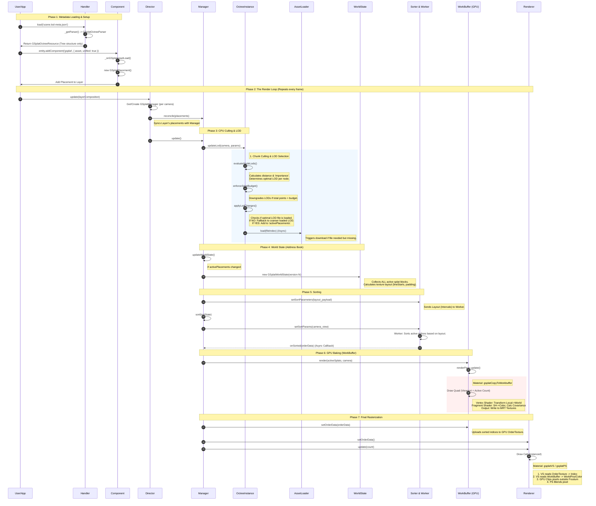

这是一个非常宏大的工程。为了确保逻辑的绝对严谨，我将整个 PlayCanvas 3DGS (Unified) 的渲染管线梳理为**8个核心阶段**。

这份文档将去除之前的任何模糊地带，明确区分 CPU 逻辑（LOD、剔除）与 GPU 逻辑（Baking、Rasterization），并精确到方法调用。

### 核心类与代码索引表

在阅读时序图前，请先对照以下核心类及其职责与代码位置：

| 缩写 | 类名 (Class Name) | 核心职责 | 代码位置 |
| :--- | :--- | :--- | :--- |
| **Handler** | `GSplatHandler` | 资源加载入口 | `src/framework/handlers/gsplat.js` |
| **Parser** | `GSplatOctreeParser` | 解析八叉树结构 (不含点云数据) | `src/framework/parsers/gsplat-octree.js` |
| **Comp** | `GSplatComponent` | 实体组件，创建 Placement | `src/framework/components/gsplat/component.js` |
| **Director** | `GSplatDirector` | 渲染总管，管理不同相机的 Manager | `src/scene/gsplat-unified/gsplat-director.js` |
| **Manager** | `GSplatManager` | **核心大脑**，调度 LOD、排序、渲染 | `src/scene/gsplat-unified/gsplat-manager.js` |
| **OctInst** | `GSplatOctreeInstance` | **CPU 剔除与 LOD 计算者** | `src/scene/gsplat-unified/gsplat-octree-instance.js` |
| **State** | `GSplatWorldState` | **地址簿**，定义 WorkBuffer 布局 | `src/scene/gsplat-unified/gsplat-world-state.js` |
| **Sorter** | `GSplatUnifiedSorter` | 排序接口，负责与 Worker 通信 | `src/scene/gsplat-unified/gsplat-unified-sorter.js` |
| **WB** | `GSplatWorkBuffer` | **GPU 数据烘焙器** (Pre-process) | `src/scene/gsplat-unified/gsplat-work-buffer.js` |
| **Renderer** | `GSplatRenderer` | 最终绘制者 (Rasterization) | `src/scene/gsplat-unified/gsplat-renderer.js` |

---

### 完整流程时序图 (The Unified Pipeline)

这张图展示了从加载 `.lod-meta.json` 开始，到画面出现在屏幕上的完整生命周期。

---

### 详细步骤解析与代码依据

#### 1. 资源加载与结构解析 (Static Setup)
*   **动作**: 加载 `.lod-meta.json`。
*   **关键点**: 此时**不加载**任何点云数据 (`.ply`)。只建立了八叉树的骨架（Nodes, AABBs, 文件名映射）。
*   **代码**: `src/framework/parsers/gsplat-octree.js`。

#### 2. CPU 剔除与流式 LOD (The Filter)
这是决定“谁能进入 GPU”的关键漏斗。

*   **方法**: `GSplatOctreeInstance.updateLod` (L455)
*   **粗粒度剔除 (Chunk Culling)**:
    *   在 `evaluateNodeLods` (L490) 中，计算相机到节点包围盒的距离。
    *   **Behind Penalty** (L522): 如果节点在相机背后，距离被人为放大，导致 LOD 降低甚至被剔除（LOD -1）。
*   **资源过滤 (Underfill Strategy)**:
    *   在 `applyLodChanges` (L680) 中，即便算法认为该显示 LOD 0，但如果文件没加载完，系统会退而求其次显示 LOD 1 或 2。
    *   **只有** `resource` 存在的 Placement 才会进入 `activePlacements` (L888)。

#### 3. 世界状态构建 (The Address Book)
*   **方法**: `GSplatManager.updateWorldState` (L296)
*   **作用**: 这是一个“快照”。它把当前帧所有通过了 CPU 筛选的 Splat 块，拍扁成一个列表。
*   **重要性**: 它定义了 **WorkBuffer 纹理的内存布局**。比如 Block A 占前 100 个像素，Block B 占后 200 个。这个布局信息会同时发给 Worker (用于排序) 和 WorkBuffer (用于渲染)。

#### 4. GPU 烘焙 (WorkBuffer Baking)
*   **方法**: `GSplatWorkBuffer.render` (L229) -> `GSplatWorkBufferRenderPass.execute` (L90)
*   **误区澄清**: 这里**不做**视锥剔除。
*   **逻辑**:
    *   遍历 `activeSplats`。
    *   调用 `gsplatCopyToWorkbuffer` Shader。
    *   **Transform**: 将 Local Space 的点乘上 `splatInfo.node.worldTransform` 变到 World Space。
    *   **SH Evaluation**: 计算球谐函数，转为 RGB 颜色。
    *   结果写入 MRT 纹理 (`splatColor`, `splatTexture0`, `splatTexture1`)。

#### 5. 排序 (Sorting)
*   **方法**: `GSplatUnifiedSorter.setSortParams` (L194) -> Worker
*   **数据一致性**: Worker 收到的 `intervals` (区间) 必须与 WorkBuffer 的布局完全一致。
*   **输出**: 一个 `Uint32Array`，里面存的是 WorkBuffer 的**纹理索引**。例如 `order[0] = 500` 意味着“画的第一个点，请去 WorkBuffer 的第 500 个像素取数据”。

#### 6. 最终渲染 (Final Rasterization)
*   **方法**: `GSplatRenderer.createMeshInstance` (L303) / `update` (L182)
*   **精细剔除 (Frustum Culling)**:
    *   Draw Call 提交了所有活跃点。
    *   Vertex Shader (`gsplatVS`) 将 World Space 点投影到 Clip Space。
    *   **GPU 硬件** 自动执行 Clipping/Culling。如果一个点在屏幕外，它在这里被丢弃。
*   **渲染**: Pixel Shader (`gsplatPS`) 只需要进行高斯函数的 Alpha 测试和混合，不再需要处理复杂的 SH 或矩阵变换。

### 总结
PlayCanvas 的这套架构实现了**“CPU 负责粗略筛选与调度，WorkBuffer 负责数据标准化与预计算，GPU 负责精细渲染”**的高效流水线。

*   **WorkBuffer** 是数据中转站，确保了渲染 Shader 的极简。
*   **GSplatWorldState** 是连接 CPU 逻辑和 GPU 数据布局的“协议”。
*   **剔除** 分两步：CPU 剔除块 (Chunks)，GPU 剔除像素 (Pixels)。