基于对代码的深入分析，我将为您提供一份完整、严谨的3DGS数据加载、解析、渲染全流程时序图，包含所有关键类的协作关系和具体方法调用。

## 3DGS 统一渲染全流程时序图

```mermaid
sequenceDiagram
    autonumber
    title: PlayCanvas 3DGS 统一渲染全流程时序图

    participant App as 示例应用
    participant Handler as GSplatHandler
    participant Parser as GSplatOctreeParser
    participant OctRes as GSplatOctreeResource
    participant Comp as GSplatComponent
    participant Sys as GSplatComponentSystem
    participant Dir as GSplatDirector
    participant Mgr as GSplatManager
    participant Inst as GSplatOctreeInstance
    participant World as GSplatWorldState
    participant Sorter as GSplatUnifiedSorter
    participant Worker as UnifiedSortWorker
    participant WB as GSplatWorkBuffer
    participant Rend as GSplatRenderer
    participant GPU as GPU处理单元

    %% ==================== 初始化阶段 ====================
    note over App, GPU: === 初始化阶段 (Initialization) ===
    
    App->>Handler: load(url) [src/framework/handlers/gsplat.js:26-38]
    Handler->>Parser: GSplatOctreeParser.load(url) [src/framework/parsers/gsplat-octree.js:34-60]
    Parser->>OctRes: new GSplatOctreeResource() [src/scene/gsplat-unified/gsplat-octree.resource.js:17-21]
    OctRes-->>App: 资源加载完成
    
    App->>Comp: entity.addComponent('gsplat') [src/framework/components/gsplat/component.js:715-754]
    Sys->>Dir: 创建GSplatDirector [src/framework/components/gsplat/system.js:111]
    Dir->>Renderer: 挂接导演到ForwardRenderer [src/scene/renderer/forward-renderer.js:1020]

    %% ==================== 第一帧渲染 ====================
    note over App, GPU: === 第一帧渲染 (First Frame) ===
    
    App->>Dir: ForwardRenderer.update(comp) [src/scene/renderer/forward-renderer.js:1020]
    Dir->>Mgr: LayerData.createManager() [src/scene/gsplat-unified/gsplat-director.js:44-66]
    Mgr->>Inst: reconcile(placements) [src/scene/gsplat-unified/gsplat-manager.js:233-266]
    
    Mgr->>Inst: updateLod(camera) [src/scene/gsplat-unified/gsplat-octree-instance.js:455-475]
    Inst->>Inst: evaluateNodeLods() [src/scene/gsplat-unified/gsplat-octree-instance.js:490-564]
    Inst->>Inst: applyLodChanges() [src/scene/gsplat-unified/gsplat-octree-instance.js:680-790]
    Inst->>OctRes: ensureFileResource(fileIndex) [src/scene/gsplat-unified/gsplat-octree.js:333-368]
    
    Mgr->>World: updateWorldState() [src/scene/gsplat-unified/gsplat-manager.js:296-368]
    World->>Sorter: prepareSortParameters() [src/scene/gsplat-unified/gsplat-manager.js:845-867]
    Mgr->>Sorter: setSortParams() [src/scene/gsplat-unified/gsplat-manager.js:794-843]
    Sorter->>Worker: sort() [src/scene/gsplat-unified/gsplat-unified-sort-worker.js:72-114]
    
    Worker-->>Mgr: onSorted(count, orderData) [src/scene/gsplat-unified/gsplat-manager.js:370-405]
    Mgr->>WB: resize(textureSize) [src/scene/gsplat-unified/gsplat-work-buffer.js:120-165]
    Mgr->>WB: render(splats, camera) [src/scene/gsplat-unified/gsplat-work-buffer.js:229-242]
    WB->>GPU: MRT烘焙到纹理 [src/scene/gsplat-unified/gsplat-work-buffer-render-pass.js:66-112]
    
    Mgr->>WB: setOrderData(orderData) [src/scene/gsplat-unified/gsplat-work-buffer.js:186-192]
    Mgr->>Rend: setOrderData() [src/scene/gsplat-unified/gsplat-renderer.js:195-202]
    Mgr->>Rend: update(count, textureSize) [src/scene/gsplat-unified/gsplat-renderer.js:182-193]
    Rend->>GPU: 最终渲染绘制 [src/scene/gsplat-unified/gsplat-renderer.js:256-281]

    %% ==================== 常规帧渲染 ====================
    note over App, GPU: === 常规帧渲染 (Steady State) ===
    
    loop 每帧循环
        Mgr->>Sorter: applyPendingSorted() [src/scene/gsplat-unified/gsplat-manager.js:580-583]
        Mgr->>Mgr: testCameraMovedForSort() [src/scene/gsplat-unified/gsplat-manager.js:639-642]
        
        alt 变换更新
            Mgr->>WB: render(_updatedSplats) [src/scene/gsplat-unified/gsplat-manager.js:754-758]
        else 颜色更新
            Mgr->>WB: renderColor(_splatsNeedingColorUpdate) [src/scene/gsplat-unified/gsplat-manager.js:760-769]
        end
        
        Mgr->>Mgr: fireFrameReadyEvent() [src/scene/gsplat-unified/gsplat-manager.js:568-578]
        Mgr->>OctRes: updateCooldownTick() [src/scene/gsplat-unified/gsplat-octree.js:303-331]
    end
```



## 关键类职责与协作关系详解

### 1. 资源加载层 (Resource Loading)
- **GSplatHandler** (`src/framework/handlers/gsplat.js:26-38`): 资源处理入口，根据文件扩展名选择解析器
- **GSplatOctreeParser** (`src/framework/parsers/gsplat-octree.js:34-60`): 解析.lod-meta.json并构造八叉树资源
- **GSplatOctreeResource** (`src/scene/gsplat-unified/gsplat-octree.resource.js:17-21`): 管理八叉树节点与文件资源

### 2. 组件系统层 (Component System)  
- **GSplatComponent** (`src/framework/components/gsplat/component.js:715-754`): 实体组件，统一模式下创建GSplatPlacement
- **GSplatComponentSystem** (`src/framework/components/gsplat/system.js:111`): 系统初始化，创建GSplatDirector

### 3. 调度管理层 (Director & Manager)
- **GSplatDirector** (`src/scene/gsplat-unified/gsplat-director.js:44-66`): 调度器，按相机+Layer组合管理GSplatManager
- **GSplatManager** (`src/scene/gsplat-unified/gsplat-manager.js:233-266`): 统一渲染大脑，协调所有子模块

### 4. LOD决策层 (LOD Decision)
- **GSplatOctreeInstance** (`src/scene/gsplat-unified/gsplat-octree-instance.js:455-475`): LOD状态机，两阶段更新
  - `evaluateNodeLods()`: 基于AABB和距离计算最佳LOD
  - `applyLodChanges()`: 应用underfill策略和文件引用

### 5. 世界状态层 (World State)
- **GSplatWorldState** (`src/scene/gsplat-unified/gsplat-manager.js:296-368`): 版本化世界状态快照
  - 包含所有活跃GSplatInfo、intervals合并、textureSize等

### 6. 排序处理层 (Sorting)
- **GSplatUnifiedSorter** (`src/scene/gsplat-unified/gsplat-manager.js:794-843`): 主线程排序接口
- **UnifiedSortWorker** (`src/scene/gsplat-unified/gsplat-unified-sort-worker.js:72-114`): Web Worker基数排序
  - 使用intervals和lineStarts映射到WorkBuffer索引

### 7. GPU预处理层 (Work Buffer)
- **GSplatWorkBuffer** (`src/scene/gsplat-unified/gsplat-work-buffer.js:229-242`): GPU数据烘焙中心
  - MRT渲染到color/splatTexture0/splatTexture1
  - 使用gsplatCopyToWorkbuffer着色器进行坐标变换和SH计算

### 8. 最终渲染层 (Renderer)
- **GSplatRenderer** (`src/scene/gsplat-unified/gsplat-renderer.js:182-193`): 统一材质渲染
  - 绑定WorkBuffer纹理和排序数据
  - 控制Instancing数量和材质模式切换

## 关键数据流与一致性保证

### 数据映射机制
```javascript
// 世界状态布局是唯一真源 (src/scene/gsplat-unified/gsplat-manager.js:845-867)
{
    textureSize,        // WorkBuffer纹理尺寸
    totalUsedPixels,    // 有效像素总数  
    lineStarts,        // 每个Splat在纹理中的起始行
    padding,           // 填充信息
    intervals          // 有效区间列表
}
```

### 排序一致性
Worker使用intervals区间按lineStarts写入distances，构造order数组，确保索引与WorkBuffer连续像素完全一致 (`src/scene/gsplat-unified/gsplat-unified-sort-worker.js:72-114`)

### 材质切换策略
- **预处理阶段**: 使用`gsplatCopyToWorkbuffer`着色器 (GLSL/WGSL chunk)
- **渲染阶段**: 使用`UnifiedSplatMaterial`，仅采样WorkBuffer纹理和splatOrder

## 性能优化关键点

1. **分层剔除策略**: CPU粗粒度块级剔除 + GPU精细像素级剔除
2. **异步排序**: Web Worker基数排序不阻塞主线程
3. **数据紧凑化**: WorkBuffer连续无空隙布局
4. **双缓冲机制**: 排序与渲染并行处理
5. **按需更新**: 变换和颜色阈值更新机制

这份时序图完整展示了从资源加载到最终渲染的全链路，每个步骤都有明确的代码位置依据，消除了之前关于WorkBuffer职责的误区，清晰呈现了PlayCanvas统一渲染架构的精妙设计。